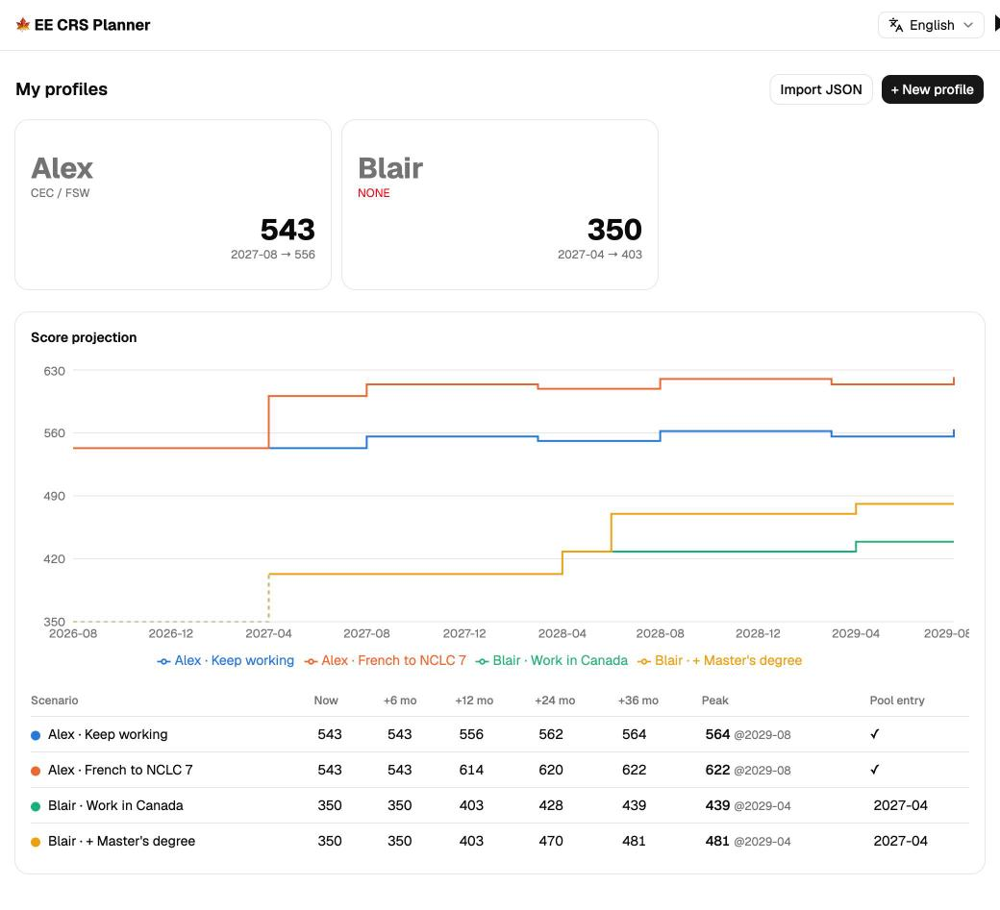
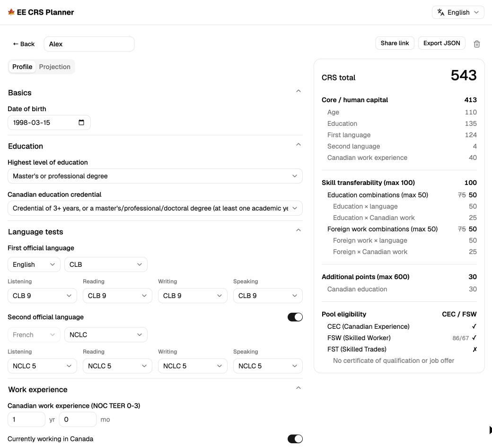

# EE CRS Planner

[](https://github.com/muhac/ee-crs-planner/actions/workflows/deploy.yml)
[](https://muhac.github.io/ee-crs-planner/)

[](https://www.canada.ca/en/immigration-refugees-citizenship/services/immigrate-canada/express-entry/check-score/crs-criteria.html)
[](LICENSE)

English · [简体中文](./README.zh-CN.md)

**Live app: https://muhac.github.io/ee-crs-planner/**

Score your Express Entry profile today — and see what it becomes after a year of Canadian work, a better IELTS, or a French course.





- **Score** — full per-factor CRS breakdown, updated live. Language results go in as CLB/NCLC levels or as raw IELTS / CELPIP / PTE / TEF / TCF scores, converted per the official IRCC charts.
- **Project** — age advances, work experience accrues month by month, and dated events (language retest, education upgrade, provincial nomination) take effect on schedule, plotted as monthly score curves.
- **Plan** — multiple profiles and side-by-side what-if scenarios; pool eligibility (CEC / FSW with the 67-point grid / FST) with reasons for every miss, plus the earliest entry month per scenario.

Also an installable PWA that works fully offline, responsive down to phones, with a six-language UI (English / Français / Español / 简体中文 / 繁體中文 / हिन्दी).

## Private by design

Everything stays in your browser: profiles live in localStorage, share links encode the data in the URL itself, and JSON export/import is your backup. No server, no accounts, no analytics.

## Accuracy

Point tables are transcribed from the [official IRCC CRS criteria](https://www.canada.ca/en/immigration-refugees-citizenship/services/immigrate-canada/express-entry/check-score/crs-criteria.html) (June 2026 edition) and verified value-by-value against the live IRCC pages — the CRS grid, the language-test equivalency charts, and the program eligibility rules (August 2026). For reference only — always defer to IRCC. Found a discrepancy? Open an issue.

## Development

```bash
npm install
npm run dev      # local dev server
npm test         # scoring engine + storage tests (vitest)
npm run build    # static output in dist/, deployable to any static host
```

## Stack & structure

Vite + React 19 + TypeScript · Tailwind CSS v4 + shadcn/ui · Recharts · react-i18next · Vitest

```
src/
├── engine/       # Pure TS scoring engine: official point tables (tables.ts),
│                 # scoring (crs.ts), month-by-month projection (simulate.ts)
├── storage/      # localStorage persistence, JSON/share-link codec (lz-string)
├── i18n/         # react-i18next setup + locale dictionaries (typed against zh-CN)
├── hooks/        # useAppData: profile CRUD with auto-persistence
├── components/   # forms, score panel, projection charts
└── lib/          # labels, defaults
```

The scoring engine is fully decoupled from the UI: when IRCC changes the rules, only `src/engine/tables.ts` needs updating, with the test suite guarding the rest.
